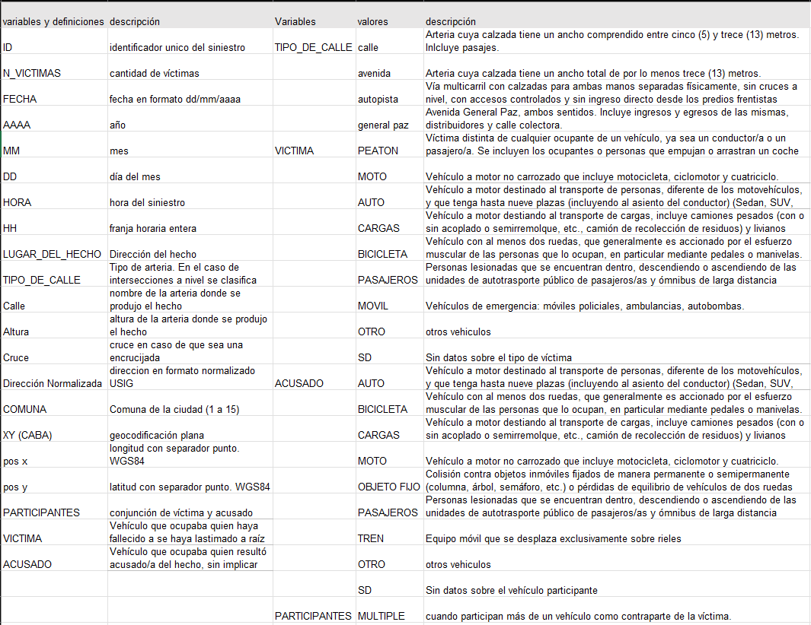
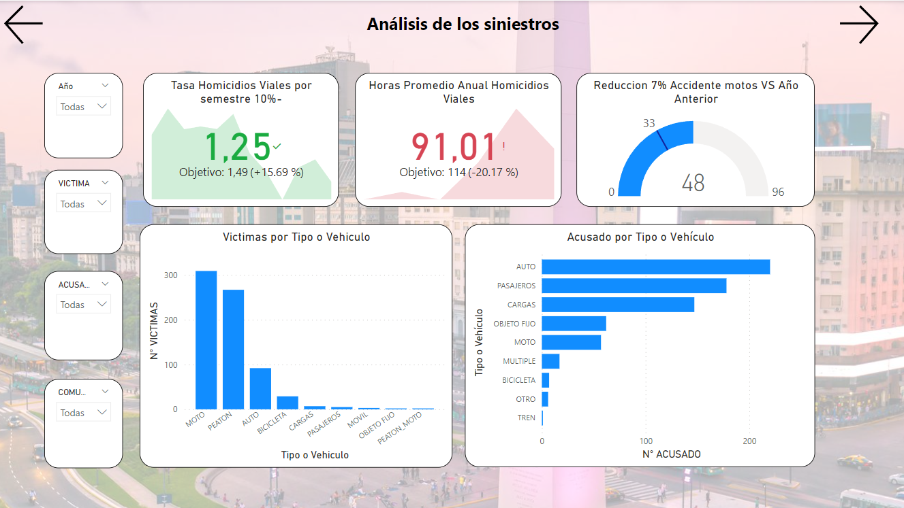
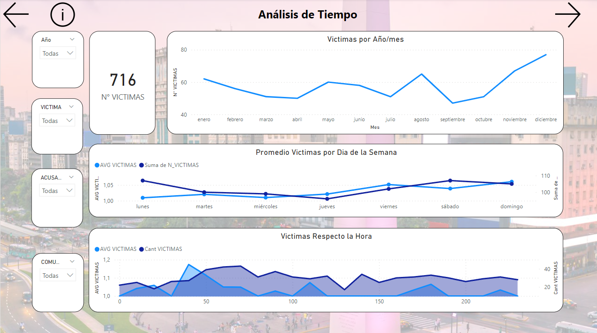
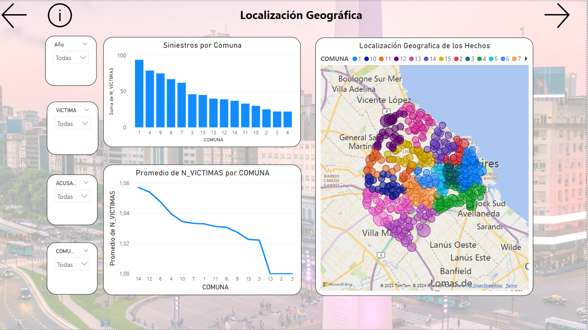
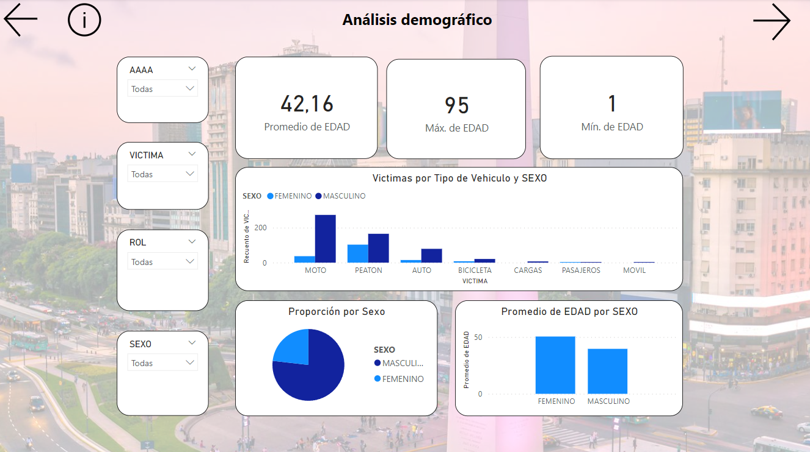
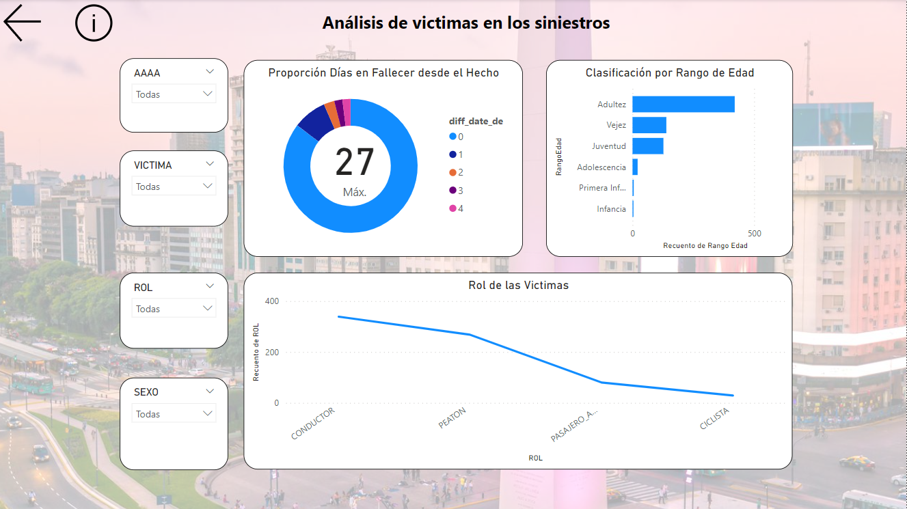

<h1 align='center'>
 <b>PROYECTO INDIVIDUAL Nº2</b>
</h1>

<h1 align='center'>
 <b>***Data Analyst***.</b>
</h1>
 
# <h1 align="center">**`Siniestros viales`**</h1>

<h1 align='center'>
 <b>Jessica Leandra Velasco</b>
</h1>

# **Introducción**

El Observatorio de Movilidad y Seguridad Vial (OMSV), un centro de estudios adscrito a la Secretaría de Transporte del Gobierno de la Ciudad Autónoma de Buenos Aires, nos ha confiado la realización de un proyecto de análisis de datos. El propósito principal de este proyecto es proporcionar información clave que permita a las autoridades locales tomar medidas efectivas para reducir la cantidad de víctimas fatales en los siniestros viales.

Contamos con un dataset exhaustivo que abarca información detallada sobre los homicidios en siniestros viales ocurridos en la Ciudad de Buenos Aires durante el período comprendido entre 2016 y 2021. Este conjunto de datos ofrece una perspectiva integral de los accidentes de tránsito en la ciudad, incluyendo datos sobre el número y tipo de víctimas, características de los siniestros, y otros factores relevantes.

Mediante este informe, nos proponemos analizar en profundidad los patrones y tendencias observados en estos incidentes, con el objetivo de identificar áreas de mejora y oportunidades para implementar medidas preventivas. Nuestra meta final es contribuir a la formulación de políticas y acciones que promuevan la seguridad vial y reduzcan la incidencia de accidentes en la Ciudad de Buenos Aires.

# **Diccionario**

# **Desarrollo**

  
  
  
  
  

`Dashboard`

Se crearon cinco paneles interactivos en la plataforma Power BI, cada uno enfocado en un aspecto clave del análisis de siniestros viales. El primer panel agrupa cinco visualizaciones distintas: la primera presenta un análisis de siniestros con KPIs relevantes, la siguiente muestra información temporal detallada por día y hora, le sigue un panel de ubicación geográfica que presenta datos por comuna junto con un mapa interactivo, y finalmente, un análisis demográfico detallado de las víctimas, incluyendo sus roles y otros elementos relevantes.

`KPIs`
Objetivo 1: Reducción de la Tasa de Homicidios en Siniestros Viales

Se persigue la meta de disminuir en un 10% la tasa de homicidios en siniestros viales de los últimos seis meses en la Ciudad Autónoma de Buenos Aires (CABA), en comparación con la tasa del semestre anterior. La tasa de homicidios en siniestros viales se define como el número de víctimas fatales en accidentes de tránsito por cada 100,000 habitantes en una zona geográfica durante un período específico.

Objetivo 2: Reducción de Accidentes Mortales de Motociclistas

Se busca reducir en un 7% la cantidad de accidentes mortales de motociclistas en el último año en CABA, en comparación con el año anterior. Definimos la cantidad de accidentes mortales de motociclistas en siniestros viales como el número absoluto de accidentes fatales en los que estuvieron involucradas víctimas que viajaban en moto en un periodo determinado.

Objetivo 3: Mantener las Horas Promedio de Respuesta

El tercer objetivo se centra en mantener las horas promedio en las que se responde a un siniestro por encima de 114 horas.

`Análisis`
Durante el análisis, se identificaron diversos indicadores de riesgo. Se observa que los días de fin de semana, especialmente en las primeras horas de la madrugada, presentan promedios más elevados de siniestros viales. En la mayoría de los casos, las víctimas son motociclistas. Además, el promedio de muertes por hora revela que las 4 de la mañana tienen el valor más alto, señalando un momento crítico en términos de accidentes viales.

## ETL - EDA

`ETL`

Durante el proceso de Extracción, Transformación y Carga (ETL), se llevaron a cabo las siguientes etapas:

Extracción: Se cargaron los archivos con extensión .xlsx utilizando Visual Studio Code con Python. Para el tratamiento de datos, se emplearon las librerías Pandas, NumPy y re.

Transformación: Se realizó una exhaustiva revisión de la información identificando filas con valores 'SD', indicativos de datos faltantes. Dada su baja proporción, se implementaron métodos estadísticos como la media y la moda para imputar estos valores faltantes. Se llevaron a cabo acciones como la verificación de duplicados, formateo de columnas y eliminación de una fila poco relevante para el análisis.

Carga: Los datos procesados se exportaron finalmente a un archivo CSV. Este proceso garantizó la integridad y consistencia de los datos, preparándolos para análisis subsiguientes.

`EDA`

En la fase de Análisis Exploratorio de Datos (EDA), se utilizó el conjunto de datos procesados obtenido del proceso ETL. Se comenzó con una descripción general de las columnas mediante el método .describe(include='all'). Se identificaron los valores más frecuentes (top) tanto para víctimas como para acusados, estableciendo bases para un análisis detallado.

Se procedió a verificar la presencia de posibles valores atípicos en las columnas de longitud y latitud, asegurando la correcta referencia geográfica para una única ciudad. La columna N_VICTIMAS fue analizada en busca de valores atípicos, identificando un caso con 3 víctimas que fue investigado en detalle.

Se exploró la relación entre días de la semana, hora del día y número de víctimas. Se observó un aumento leve los fines de semana, especialmente los viernes, y se profundizó en estos patrones para los días viernes, sábado y domingo, identificando un pico significativo los domingos entre las 5 y las 7 de la mañana.

Adicionalmente, se llevó a cabo un análisis detallado por tipo de víctima y acusado, revelando que los acusados en esos días y horas eran principalmente automóviles y objetos fijos, mientras que las víctimas eran mayormente motociclistas y peatones. Estos hallazgos proporcionan una perspectiva detallada de la dinámica de los accidentes viales en los momentos específicos mencionados.

# **Conclusión**

Se destaca la importancia de abordar de manera integral los desafíos relacionados con la seguridad vial en la Ciudad de Buenos Aires. La disminución de la cantidad de accidentes viales y, en particular, de los homicidios en siniestros viales, emerge como un objetivo crucial.

Las conclusiones derivadas de los paneles de control y el análisis detallado de los datos sugieren que factores como las actividades nocturnas, el consumo de alcohol y la fatiga pueden estar contribuyendo a un aumento en la tasa de homicidios viales. La identificación de patrones específicos, como el mayor número de accidentes los domingos y durante las primeras horas de la mañana, proporciona información valiosa para orientar medidas preventivas.

La necesidad de considerar diferentes perspectivas y enfoques al abordar la problemática es fundamental. Las recomendaciones contundentes presentadas resaltan la urgencia de implementar estrategias efectivas para mejorar la seguridad vial y reducir los accidentes, teniendo en cuenta las particularidades identificadas en el análisis.

En general, se observa la relevancia de la combinación de herramientas como Power BI, el análisis exploratorio de datos y la aplicación de técnicas de ETL para extraer, transformar y cargar datos de manera efectiva. Este proceso garantiza la integridad y consistencia de la información, permitiendo así un análisis robusto y la identificación de áreas críticas que requieren atención y acción inmediata.

En resumen, el análisis de datos realizado proporciona una base sólida para la toma de decisiones informadas por parte de las autoridades locales, con el objetivo de implementar políticas y medidas que mejoren la seguridad vial y reduzcan la incidencia de accidentes en la Ciudad de Buenos Aires.

